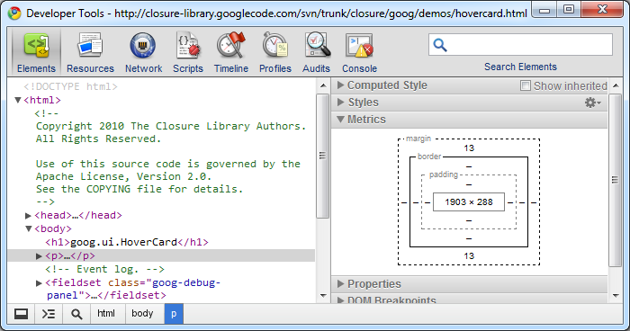
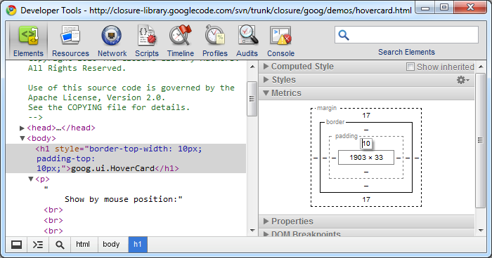
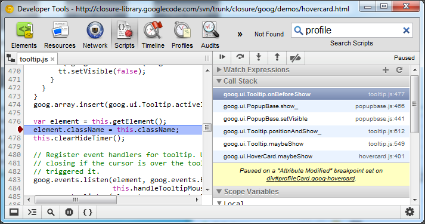

#Chrome开发工具: 元素面板

元素面板可以让你观察整个DOM树, 便于检查以及即时的编辑dom元素.当你需要检查一个HTML片段时,你就需要使用Elements面板.举个例子, 你可以查看一个图片是否具有某个id,并且获得这个id的值.

元素面板有时候相比查看源码来说更有用.
在元素面板中, 页面的DOM被更好的格式化,更清晰的展示你的html, 父节点子节点的关系. 很多时候，页面的HTML在输出时是做了压缩的,这样便不利于问题的排查,元素面板则可以方便的显示结构. 

按下F12,会出现chrome的开发者面板,然后选择Elements就可以看到元素面板: 

这里展示了页面的html元素,右侧展示了样式,布局,属性以及事件监听的情况.
如果用户使用“审查元素”的方式进入元素面板,面板会自动的定位到这个元素.

##DOM元素树部分

在元素数结构中,包括了它的内联脚本和内联样式,并且都使用了语法高亮来展示.
例如,我们选择了`<script>`标签.你就可以看到下图这样:

选择 `
` 元素后, 你则可以看到如下的视图: 

你可以在这个面板中添加编辑删除dom元素的属性.当前`
`元素没有任何的属性.我们可以对其添加属性.

  - 双击这个元素,你就可以编辑一个元素的属性,回车后就完成了编辑.使用Tab可以在各个属性之间切换.
  - 使用Delete键可以删除元素节点.
  - 你还可以使用拖动来改变一个元素在父节点中的位置,甚至是把它移到另一个节点下.

##CSS 样式

由于CSS本身的层叠的特性,在元素面板中使用样式查看器查看样式对你非常有用.
通常情况下, 样式是在页面的显示是有层叠关系的,有时候调试的时候会看到你不期望的样式.知道起作用的是哪个样式就显得很重要.

点击放大镜按钮,进入元素审查模式.选择对应的元素. 我们可以看到这个元素被高亮,并且它对应的样式也显示出来. 

我们可以很清楚的看到哪些样式被应用了.举例来说,此处,padding的样式来自class等于anchor的`span`元素.font的样式在body有定义,不过被`.anchor`的样式又覆盖了.如果是没有生效的样式,会在前面有一个三角形的警告标志.

现在要看每一个独立的样式以及他们的来源就很简单了,同时看最终样式也很清晰明了.你可以点击"Computed Style"选项卡看最终对元素生效的样式.

现在,鼠标移到 .anchor 样式对应的复选框上面,可以单独禁用元素的某一个样式.就象这样:

不选择属性,就可以禁用这个属性.

点击一个(不是灰色的)样式属性名或者值,就可以编辑他们.例如,双击`margin:20px;`属性.

在你编辑的时候,会出现自动补全提示.
要添加一个新的属性,就在元素样式定义区结尾的空白处双击.这时候你就可以添加新的属性名和对应的属性.如果你是编辑一个数字的属性,使用键盘上下键可以增减这个属性的数值.按住Alt键是按0.1的幅度改变,按住shift键是按10的幅度改变.你还可以在Gear菜单添加新的属性,我们先找到右侧的样式(Style)区.

点击样式区的加号按钮可以添加新的样式
.如果要模拟伪类(:active, :hover, :focus, :visited),则点击按钮进行添加.

##盒子模型

点击右边的布局项,然后双击布局上面的数值:

你可以编辑任何定位的盒模型.

##属性
点击属性项可以看到当前的元素对应的属性:

这里你可以编辑元素的DOM属性.

##DOM断点

你可以设置一个可以在元素DOM变化时触发的断点.
在元素上面右手键点出菜单,可以添加这个dom元素对应的事件监听类型:subtree modifications(dom树变化), attributes modifications(属性变化), and the node removal(节点移除).
我们这里选择"属性变化".例子中,当有脚本改变了这个元素的属性,断点就会被触发（下面的例子中是元素的classname被修改了导致了元素属性的变化）. 我们可以通过这个来检查脚本对dom属性的控制. 按F8可以继续代码的执行.

##事件监听

选择右侧的事件监听项:

这里按捕获和冒泡的顺序列出了被选节点的事件绑定.事件监听函数是根据类型被分类的.

你还可以在Gear菜单进行事件的筛选.这样你可以只看注册到已选节点的事件函数,或者是整个的事件流.

##搜索

利用搜索功能可以在元素面板中搜到对应符合条件的部分:

