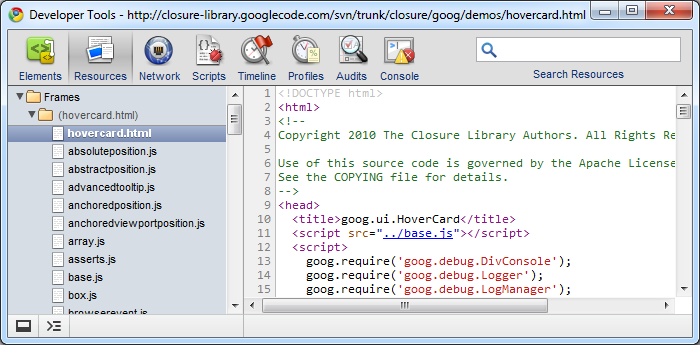
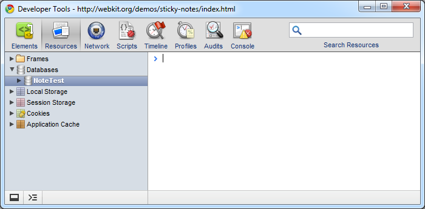
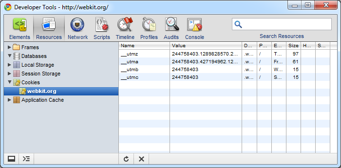

#Chrome Developer Tools: 资源面板

资源面板可以监视你在页面中载入的静态资源, 以及HTML5数据库,本地存储,Cookie和应用缓存.

打开面板后点击Resource:

#Frame资源

如上图可以查看一个页面中引入的每一个静态资源.

#HTML5数据库

数据库使用具体应用的可以参考[这里](http://webkit.org/demos/sticky-notes/index.html)

#Cookies

你可以浏览到当前域下的cookie,同样可以做删除操作.