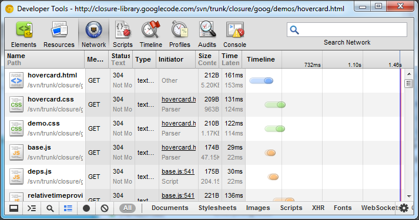
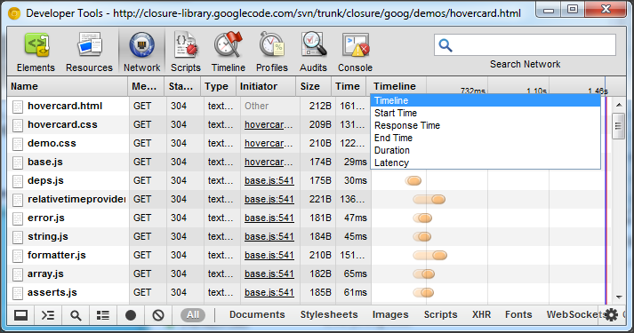
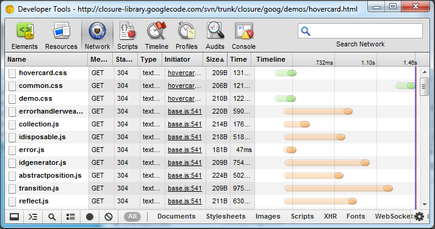

#Chrome Developer Tools: 网络面板

网络面板可以让你监视自己的页面资源下载情况：

这里显示了一张网络活动的瀑布图.Latency表示请求和服务器响应之间的事件差,它会以色块的形式显示在每一个请求中.蓝色和红色的竖线分别表示DOMContentLoaded和Load事件.这可以清楚的显示页面的载入时间.并帮你改进页面的加载事件.
通过选择下面的子集,你可以分别查看"所有资源","Documents","Stylesheets","Images"等等.

我们可以在设置 - Disable cache(禁用缓存)中设定禁用浏览器缓存, 同样, 浏览器的换成和cookie也可以通过菜单清除.

左侧的状态条允许你选择或大或小的请求列显示方式.在上面的截图中,显示的行信息更为丰富,而下面的图中信息是简化的形式显示的.Record按钮可以记录你的请求,即便页面刷新.使用清除,可以清除当前屏中的请求记录.

鼠标移到每一项上面你可以看到网络请求的详细信息.

#请求时间线

选择Timeline下拉,你可以选择不同的查看方式.

点击 Size 可以排序看到最大文件是哪一个. 

#响应详情

我们可以看到原始的HTTP头,响应的内容,Cookie等信息.