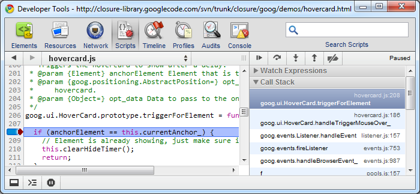

#Chrome Developer Tools: 脚本面板

脚本面板允许你进行JavaScript脚本的调试.

脚本面板中你可以看到页面中所有的脚本.
在下方的面板中提供了标准的暂停\继续\按步执行的选项.

在最下方提供了一个暂停所有的例外的按钮还有一个美化代码的按钮.

你可以对一行或者多行设置断点.你添加的所有的断点都会在右侧的区域中有显示.

点击进入断点,在右侧的面板中会显示断点处详细的信息.包括当前作用域的变量,调用栈.

在脚本面板中有一些快捷键:

  - 继续: F8 或 Mac下Command+`/`, 其他平台Control+`/`.
  - 跳过单步: F10 或 Mac下Command+`'` (单引号) on Mac,其他平台 Control+' (单引号).
  - 进入单点: F11 或 Mac下Command+; (分号) on Mac 或其他平台 Control+; (分号);.
  - 跳出单点: Shift+F11 或 Mac下Shift+Command+; (分号) 或 其他平台 Shift+Control+; (分号).
  - 调用下一帧: Control+. (点).
  - 调用前一帧: Control+, (逗号).

