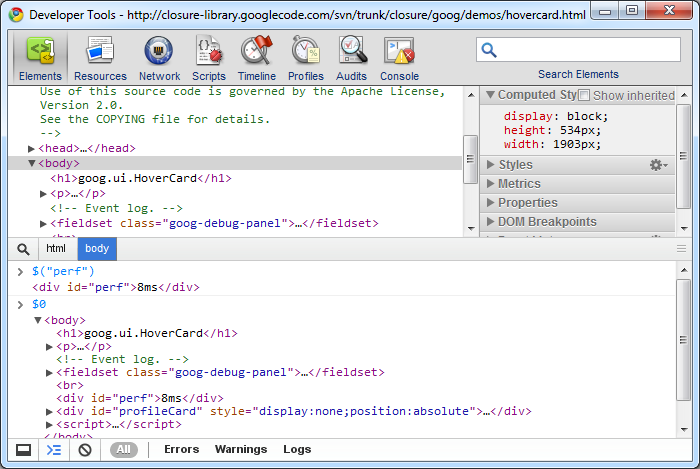

#Chrome Developer Tools:控制台面板

控制台面板可以在任何一个其他面板开启。控制台面板不像别的面板那样只做单一的事情，它可以查看DOM，debug JavaScript，分析HTML的解析错误等等。

我们先从开发者面板中打开控制台,如下:

控制台面板支持自动补全和tab补全，在你输入表达式,熟悉名时会出现自动提示。

控制台同样支持Firebug[命令行的API](http://getfirebug.com/wiki/index.php/Command_Line_API)

##在元素面板上使用控制台
我们在元素面板上按ESC呼出控制台面板。

在控制台中输入$('perf')

命令行返回了perf这个id的元素

我们再在命令行中键入`$0`

这样我们可以在控制台中得到最后一次访问的dom节点。

类似的，你可以再输入$2,$3试试。

我们再在控制台输入inspect(profileCard)

这样我们就选中了profileCard这个元素，然后我们输入`dir(profileCard)`

这样就可以看到profileCard这个dom元素的所有属性。

我们在输入`dirxml(profileCard)`

这样就会以dom树的方式展示整个元素。
