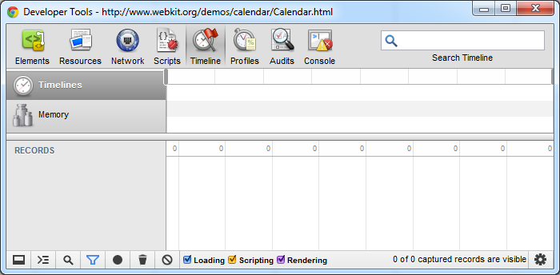
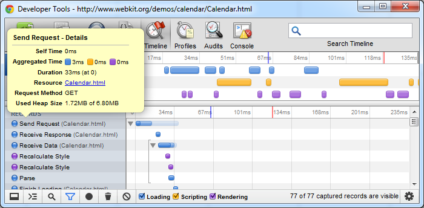
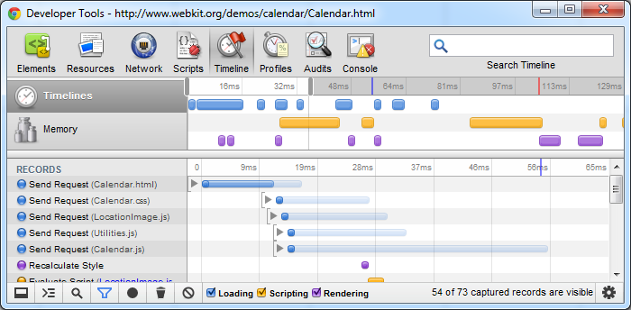
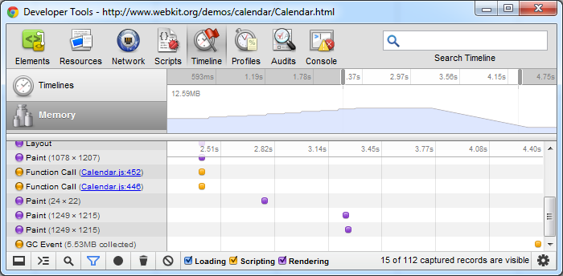

#Chrome Developer Tools: 时间线面板

时间线面板给我们提供了一个全面的关于 webApp 或者页面加载时间展示。
这其中包括了所有的事件，从资源加载到解析javascript，计算样式，重绘页面。

按下F12，在出现的chrome开发者面板中，点击Timeline即切换到了时间线的面板.

点击**record**按钮，然后按F5或者浏览器的刷新按钮，就开始了对页面加载的记录。当页面完全加载完成后，再次点击**record**按钮完成记录。

加载的时间都是以蓝色记录的，脚本执行是黄色的，渲染则是以紫色记录的。你可以在状态栏中选择要查看的项目。你也可以筛选短于15毫秒的事件 - 只需点击下方的筛选按钮即可

我们还可以看到时间标尺上面有一条蓝色的线和一条红色的线。他们分别代表DOMContentLoaded事件和load事件的时间点。

再向下一些的部分显示的是所有的事件，他们以平行线的方式排开。

注意第一个事件（Send Request），这一条线上面包含了三层不同浓度的蓝色。最深的表示这个事件本身所花费的时间，接下来这层表示这个事件伴随所有的相关的事件所花的CPU计算时间（这个例子中包括了接受请求，接收数据等），最淡的色块表示第一个相关事件的开始最后一个相关事件结束的时间间隔。

点击事件前面的小三角形可以折叠或者展开这个事件。

在标尺部分还有另一个滚动条，我们可以通过它设置开始记录的时间。通过它我们可以放大整个时间线的任何一个部分，双击一下则又会还原到整个时间线的布局.

现在我们再点击Memory来切换到Memory模式，我们可以看到内存占用的走势，当我们点击那个垃圾桶按钮进行手动GC的时候，可以看到内存明显的降低。

